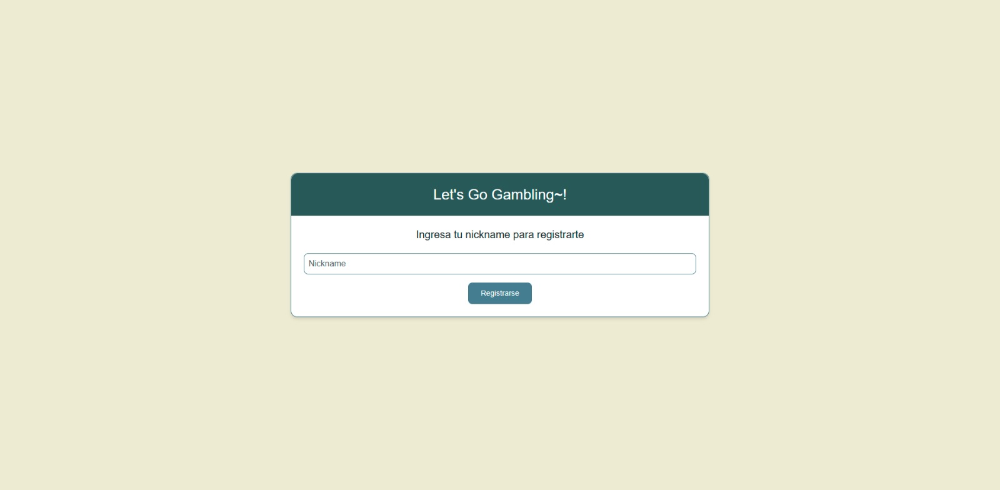
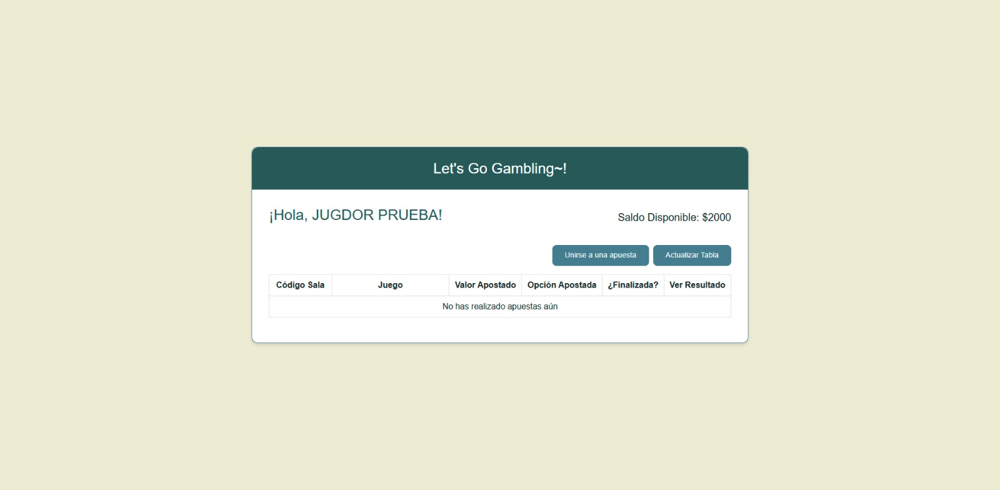
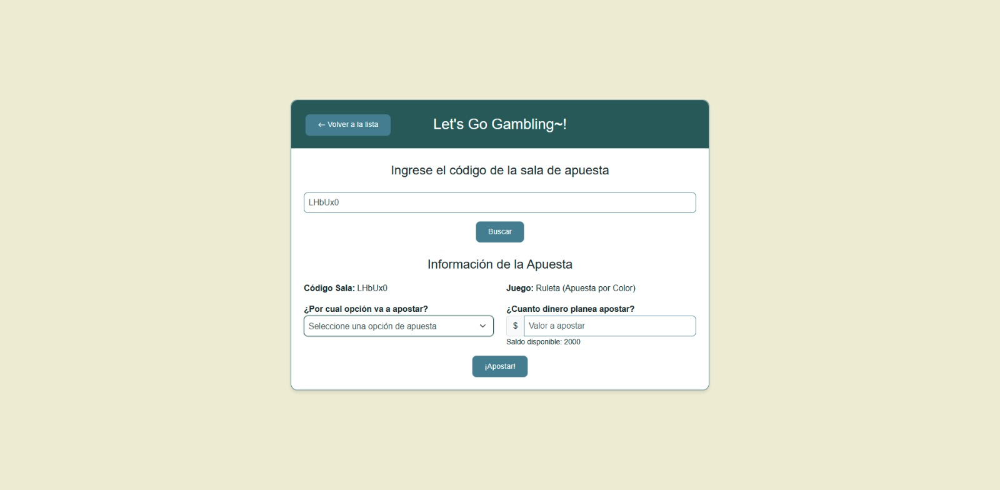
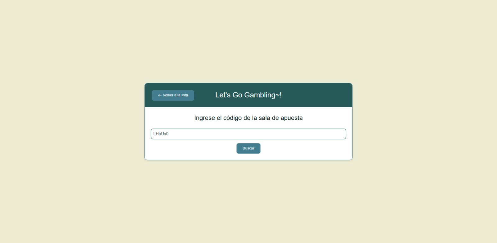

# Proyecto final Modelos de programación II
# Simulador de Gambling

Este proyecto es el Frontend del trabajo final de la materia "Modelos de Programación 2". Se trata de una aplicación de gambling en línea en la que los jugadores pueden registrarse, unirse a salas de apuestas y visualizar sus apuestas realizadas.

El frontend está desarrollado con HTML, CSS y JavaScript, utilizando Bootstrap 5.3 para el diseño y SweetAlert2 para notificaciones interactivas. Se conecta con el backend mediante peticiones a una API REST, permitiendo la gestión de usuarios, la consulta de salas activas y la realización de apuestas.

## Participantes
- Luis Miguel Viuche Madroñero (20212020082)
- Daniel Alejandro Chavez Bustos (20212020109)
- Dilan Stive Arboleda Zambrano (20212020105)

# Frontend - Let's Go Gambling\~!

## Descripción General

Este es el frontend de la aplicación **Let's Go Gambling\~!**, una plataforma de apuestas en línea donde los usuarios pueden:

- **Iniciar sesión y registrarse**.
- **Explorar salas de apuestas** disponibles.
- **Unirse a una apuesta ingresando un código de sala**.
- **Realizar y visualizar apuestas**.

El frontend está diseñado con **Bootstrap 5.3**, **SweetAlert2** para alertas y **Bootstrap Icons** para iconos.

## Tecnologías y Dependencias

Este proyecto utiliza las siguientes tecnologías:

- **HTML5, CSS3 y JavaScript** para la estructura y funcionalidad.
- **Bootstrap 5.3** para diseño responsivo y componentes visuales.
- **SweetAlert2** para alertas y notificaciones atractivas.
- **Bootstrap Icons** para iconos en botones y otros elementos.

## Estructura del Proyecto

```
/frontend
├── static/
│   ├── css/
│   │   ├── estilos.css    # Estilos personalizados
│   │   ├── reset.css      # Reset de estilos
│   ├── js/
│   │   ├── main_page.js   # Lógica para pantalla principal (pantalla 2)
│   │   ├── join_to_gam.js # Lógica para unirse a una apuesta (pantalla 3)
├── templates/
├── index.html # Pantalla de inicio de sesión / registro
├── join_room.html # Pantalla principal con lista de apuestas
├── profile.html # Pantalla de ingreso a una sala de apuestas
└── README.md              # Este archivo
```

## Instalación y Ejecución

Para visualizar el frontend localmente:

1. **Clonar el repositorio**

   ```sh
   git clone <URL_DEL_REPOSITORIO>
   cd frontend
   ```

2. **Ejecutar un servidor estático** (opcional si es necesario para ciertas funcionalidades como importar módulos JS):

   ```sh
   python -m http.server 8000
   ```

   Luego, abrir en el navegador: `https://gambling-back2-6fb9f86f7f99.herokuapp.com/templates/pantalla1.html`

## Funcionalidades

- **pantalla1.html**: Inicio de sesión y registro.


  
- **/pantalla2.html**: Muestra la lista de salas de apuestas y permite unirse.



- **/pantalla3.html**: Permite ingresar un código de sala y realizar una apuesta.





